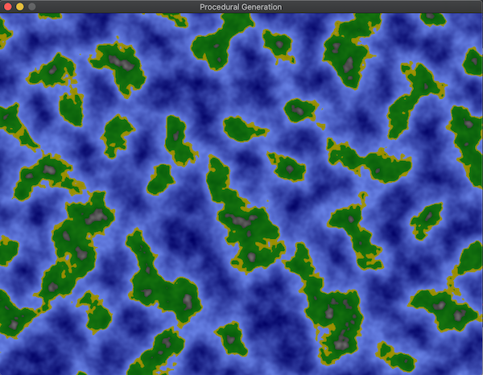
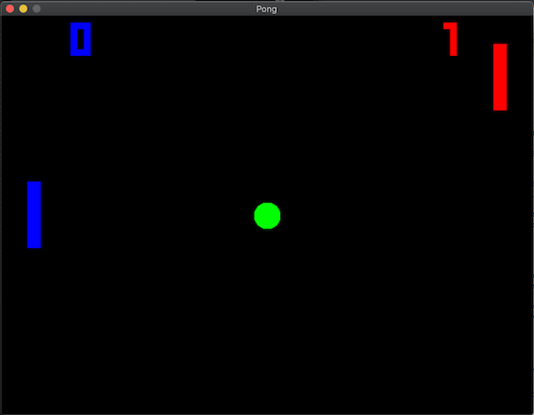

# GoExperiments
Here I will just experiment with the Go language. Creating small games, algorithms or things I find generally interesting.

## SDL Template
SDL is a very low level graphics library which I use for small prototype games

## Prodecural Generation
Simplex, Perlin and Fractal Noise to generate some nice landscapes. 
Use KEYS F, L, G, O, C, A to increase Frequency, Lacunarity, Gain, Octaves, Colormode and Algorithm and press SHIFT + KEY to decrease it 

## Pong
Simple Pong clone to learn sdl and go game dev 
Use ARROW KEYS and SPACE to play! 

