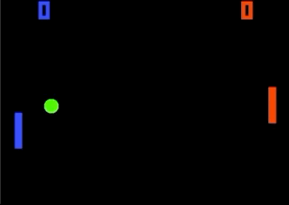
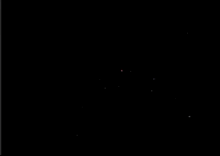

# GoExperiments
Here I will just experiment with the Go language. Creating small games, algorithms or things I find generally interesting.

## Prodecural Generation
Simplex, Perlin and Fractal Noise to generate some nice landscapes. 
Using fractal or turbulence simplex noise algorithms. Is also using go routines to calculate multithreaded with a mutex implementation to avoid race conditions.  
Use KEYS F, L, G, O, C, A to increase Frequency, Lacunarity, Gain, Octaves, Colormode and Algorithm and press SHIFT + KEY to decrease it 

## Pong
Simple Pong clone to learn sdl and go game dev 
Using SDL keyboard inputs and a simple collision detection implementation.  
Use ARROW KEYS and SPACE to play! 

## File Galaxy
Visualizes recursivly your entered directory and draws a galaxy of planets (Planet size ~ File Size) 
It's using a fermat spiral and a circle drawing algorithm (brute force) to draw the planets.  
Use KEYS S and B for increase scaling effect and planet size and SHIFT S and SHIFT B to decrease it.   

## SDL Template
SDL is a very low level graphics library which I use for small prototype games
